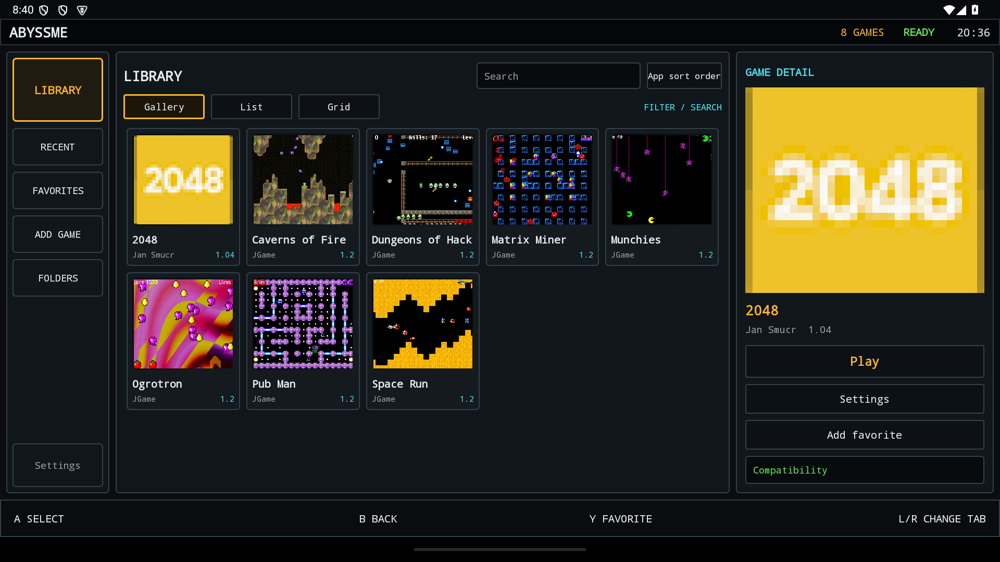
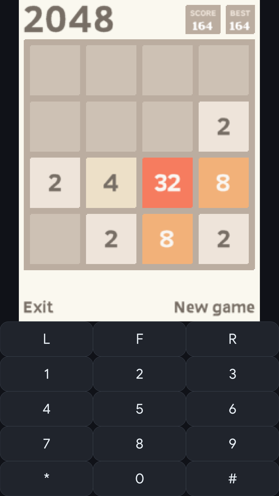
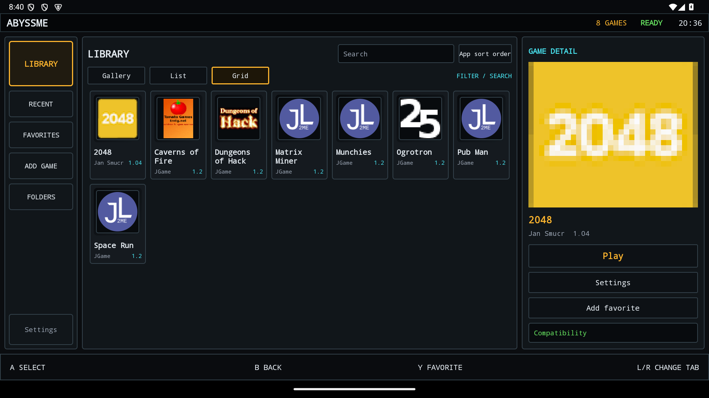
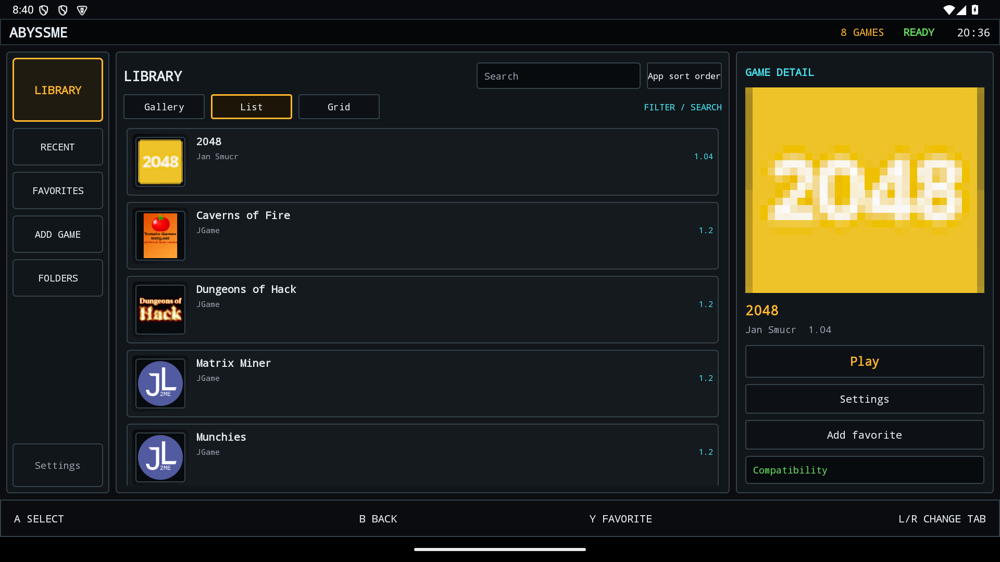
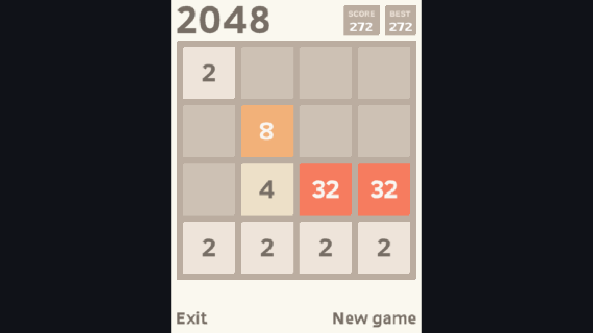
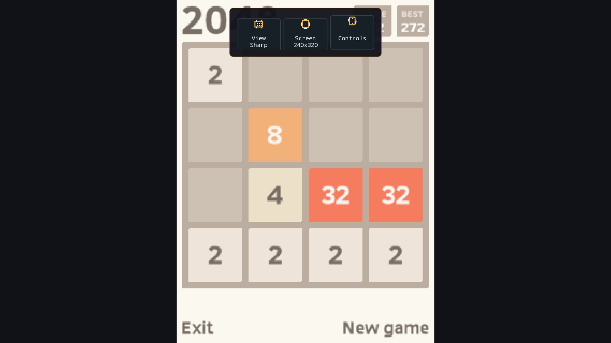
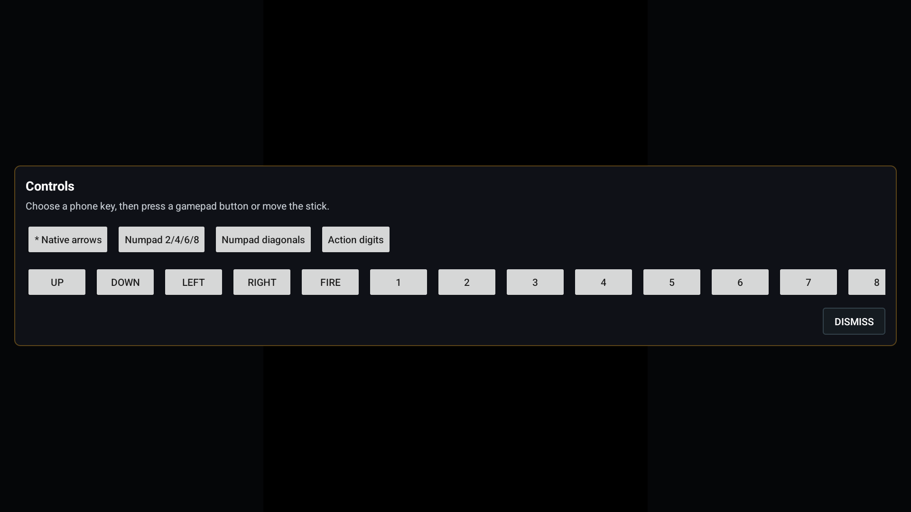

# AbyssME

**A modern J2ME emulator for Android handhelds and phones.**

AbyssME is an independent fork of
[J2ME Loader](https://github.com/nikita36078/J2ME-Loader), focused on making
old mobile Java games feel at home on modern landscape handhelds. It keeps the
proven emulation core while replacing the setup-heavy workflow with a game
library, automatic first-launch preparation, and fast per-game controller
mapping.

The current beta provides two installable variants built from the same emulation
core: a controller-first **Handheld** APK and a portrait/touch-friendly
**Phone** APK with an on-screen keypad.

> **Project status:** Beta. AbyssME is usable, but compatibility automation and
> launcher integration still need testing across more games and devices.

[Download the latest beta](https://github.com/EriArk/JavaEmulator/releases)

## Screenshots





<details>
<summary>Grid, List, gameplay and controls</summary>







</details>

Unretouched beta.2 captures from an Android 15 emulator, not a physical handheld.
Games were installed separately; Gallery artwork was selected manually.
The Phone capture uses the **Phone** keypad layout. Sources and capture details
are in the [screenshot manifest](screenshots/website-beta2/manifest.json).
Games are not bundled with the APKs.

## Highlights

- Controller-first landscape interface with Gallery, List, and Grid views
- Separate Phone build with portrait mode, direct touch input, and virtual keys
- Recent games, favorites, folders, search, sorting, and local artwork
- Automatic compatibility preparation the first time a game is launched
- Per-game named control profiles and a quick mapping overlay
- Live in-game controls for display preset and virtual screen size
- Android intent entry point for external launchers; ES-DE and Beacon setup notes
- JAR, JAD, ZIP, and 7Z sources through Android's Storage Access Framework
- Local-only library and diagnostics; no account, cloud service, or telemetry

## Requirements

- Android 10 or newer (API 29+)
- A physical controller is recommended for the Handheld build

The Handheld build is intentionally landscape-only and has no on-screen keypad.
The Phone build has a rotatable library, a compact portrait layout, direct MIDP
touch events, and configurable virtual controls. In beta.2, game launch still
selects landscape unless the Phone keypad layout is active; honoring the saved
game orientation is tracked in [#3](https://github.com/EriArk/JavaEmulator/issues/3).

## Install

1. Open [Releases](https://github.com/EriArk/JavaEmulator/releases).
2. Choose an APK:
   - `AbyssME-...-fdroid-release.apk` for handhelds and physical controllers.
   - `AbyssME-...-phone-release.apk` for phones, portrait mode, and touch keys.
3. Allow installation from your browser or file manager when Android asks.
4. Install the APK and open AbyssME.

The package IDs are `io.github.eriark.abyssme` and
`io.github.eriark.abyssme.phone`, so both variants can be installed together.
Older J2ME Loader builds also use a different package.

## Quick Start

1. Choose **Add game** for one file, or **Folders** to index a collection.
2. Select a JAR, JAD, ZIP, or 7Z file using Android's file picker.
3. Start the game. On first launch, AbyssME analyzes metadata, resources and API
   hints to select initial display and compatibility settings, then saves them.
4. On Handheld, tap the game display for quick **View**, **Screen**, and
   **Controls** actions, or hold **Select** for per-game mapping.
5. On Phone, use the on-screen keypad. Its visibility, layout, colors, haptics,
   and direct game touch input can be changed in the game's settings.
   For the portrait layout shown above, open the in-game menu and choose
   **Virtual keyboard > Switch keylayout > Phone**.

In the library, **Y** toggles the selected game as a favorite and **L1/R1**
cycles Gallery, List, and Grid views.

## External Launchers

AbyssME accepts read-only `content://` game URIs through Android `ACTION_VIEW`.
The intended flow is to prepare a new source once, launch prepared games
directly, and return to the frontend on exit. End-to-end cold/warm launch and
return behavior still needs an ES-DE/Beacon verification pass; see
[#7](https://github.com/EriArk/JavaEmulator/issues/7).

- Handheld package: `io.github.eriark.abyssme`
- Phone package: `io.github.eriark.abyssme.phone`
- Activity: `ru.playsoftware.j2meloader.MainActivity` (both variants)
- Action: `android.intent.action.VIEW`
- Supported files: JAR, JAD, ZIP, 7Z

ES-DE rule examples and Beacon setup details are in
[Launcher integration](docs/LAUNCHER_INTEGRATION.md).

## Compatibility and Fixes

Automatic preparation is heuristic: it does not run the game under several
phone profiles or verify that gameplay is correct. If a title has problems, open its
settings and use **Fix game** to describe the symptom: wrong size/cropping,
black screen/flicker, crash, or incorrect controls. The full expert settings
remain available per game without cluttering the normal flow.

Game behavior varies between phone releases. When possible, start with the
original build made for a common 176x220, 240x320, or 320x240 device profile.

## Build

See [Contributing](CONTRIBUTING.md) for the JDK/SDK versions, local signing setup
and verification checklist. There is currently a
[clean-clone signing blocker](https://github.com/EriArk/JavaEmulator/issues/1),
including for debug tasks; the guide documents a local development-key workaround.
After that setup:

```shell
./gradlew :app:assembleFdroidDebug :app:assemblePhoneDebug
```

On Windows, use `gradlew.bat`. APK output is written under
`app/build/outputs/apk/`.
GitHub Actions is intentionally disabled. Builds and checks are run locally,
and release assets are uploaded manually.

## Known Limitations

- Beta builds have not yet been validated on every controller layout or Android
  phone/handheld combination.
- Automatic phone-profile detection is heuristic and can choose the wrong
  display size for unusual game releases.
- Archives containing several JAR files require a one-time game selection.
- Some vendor-specific J2ME APIs remain limited by the upstream emulation core.
- Library schema upgrades do not yet have safe, tested migrations; see
  [#2](https://github.com/EriArk/JavaEmulator/issues/2).

Please report reproducible problems through
[GitHub Issues](https://github.com/EriArk/JavaEmulator/issues) and include the
device model, Android version, game filename, and the symptom shown in AbyssME.
Do not upload commercial game files.

Current work and unresolved decisions are tracked in
[Issues](https://github.com/EriArk/JavaEmulator/issues). Contribution instructions
and the project layout are in [CONTRIBUTING.md](CONTRIBUTING.md).

## Credits

AbyssME is built on
[J2ME Loader](https://github.com/nikita36078/J2ME-Loader) by Nikita Shakarun and
its contributors. It also includes open-source Mascot Capsule work originating
from [JL-Mod](https://github.com/woesss/JL-Mod) by woesss.

## License

Licensed under the [Apache License 2.0](LICENSE). See the repository history and
source headers for individual copyright notices.
Third-party games and artwork are not relicensed by this notice. The provenance
of legacy repository fixtures is tracked separately in [test-games](test-games/README.md).
